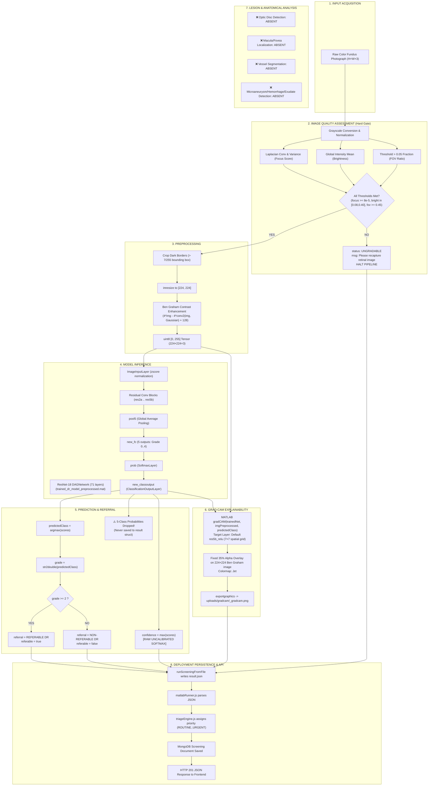

# RetinoScan AI — Complete Code-Level Audit of the AI/ML Pipeline

**Audit Date:** September 20, 2026  
**Target Repository:** `d:\SIH_Dataset`  
**Dataset Reference:** APTOS 2019 Blindness Detection (3,662 retinal fundus images)  
**Execution Environment:** Windows / MATLAB Deep Learning Toolbox / Node.js Express Backend / React 19 Frontend  
**Audit Purpose:** Comprehensive code-level inspection, execution flow tracing, architectural verification, and gap analysis of the Diabetic Retinopathy screening AI pipeline prior to system re-engineering.

---

## 1. Executive Summary

A comprehensive code-level audit of the entire machine learning and computer vision pipeline across MATLAB scripts, model weights (`.mat`), dataset metadata (`train.csv`), backend services, and frontend displays was conducted without modifying, retraining, or deleting any assets.

### Key Critical Findings:
1. **Model Dual State & Catastrophic Baseline Failure:**  
   The repository contains two model weights files:
   - `trained_dr_model.mat` (the initial deployed baseline model, identical to `trained_dr_model_backup.mat` by SHA-256 hash). Evaluation logs and confusion matrices stored in `baseline_eval_metrics.mat` and `model_comparison_results.mat` prove that **this model suffered 100% majority class collapse**: it predicts Grade 0 for every single image tested (0% sensitivity for referable DR Grade ≥ 2; 359/359 Grade 0, 74/74 Grade 1, 199/199 Grade 2, 39/39 Grade 3, 59/59 Grade 4 all predicted as 0).
   - `trained_dr_model_preprocessed.mat` (the newly trained ResNet-18 model with Kaggle/Ben Graham preprocessing). While its overall validation accuracy reached 80.41% and Grade ≥ 2 sensitivity reached 91.25%, it exhibits severe clinical confusion in severe stages: Grade 3 (Severe DR) was misclassified as Grade 2 in 25 out of 39 validation cases (only 23.1% recall), and Grade 4 was confused with Grade 2 in 26 out of 59 cases.
2. **Probability Distribution Severed at Runtime:**  
   In `drScreen.m` line 56, `[predictedClass, scores] = classify(trainedNet, imgPreprocessed)` successfully produces the 5-class Softmax probability distribution. However, **`scores` is completely omitted from the return struct `result`**. As a consequence, `runScreeningFromFile.m` does not write probabilities to `result.json`, `matlabService.js` and `screeningController.js` cannot store them, and the frontend receives **only a single scalar `confidence = max(scores)`**.
3. **"Calibrated Softmax" Claim is Technically False:**  
   No temperature scaling, Platt scaling, isotonic regression, or binning exists anywhere in the repository. The confidence score is purely raw uncalibrated maximum Softmax probability. Any UI label stating "Calibrated Softmax" is technically unjustified.
4. **Data Corruption in `train.csv` (14 Excel Scientific Notation Rows):**  
   14 image IDs in `train.csv` were corrupted into scientific notation (e.g., `'0709652336e2'` became `'7.10E+10'`). This caused `train_preprocessed_model.m` and `prepare_preprocessed_dataset_fast.m` to silently drop these 14 images.
5. **Evaluation Methodology Flaws & Data Leakage:**  
   There is **no independent test set**. The 20% validation split (730 images, `rng(42)`) was monitored during training and re-used as the final benchmark in `compare_models.m`. The APTOS competition standard metric — **Quadratic Weighted Kappa (QWK)** — is completely absent.
6. **Retinal Lesion / Anatomical Structure Detection is 100% Absent:**  
   There is zero code for optic disc detection, fovea/macula localization, vessel segmentation, microaneurysm detection, hemorrhage detection, or exudate segmentation. Any UI claims suggesting Grad-CAM performs lesion detection are clinically unfounded; Grad-CAM only produces coarse (7×7) gradient heatmaps.

---

## 2. Actual End-to-End Pipeline Trace

The deployed application executes along the following concrete call stack:

```
[User Browser / Frontend UI]
   │ (Uploads image via Operator or Doctor interface)
   ▼
[HTTP POST /api/screenings] (Express Backend, backend/src/routes/screeningRoutes.js)
   │ Handles multipart/form-data via multer, writes to backend/uploads/original/<uuid>.<ext>
   ▼
[screeningController.createScreening] (backend/src/controllers/screeningController.js:35)
   │ Calls matlabService.runScreening(originalImagePath, screeningId)
   ▼
[MatlabService.runScreening] (backend/src/services/matlab/matlabService.js:18)
   │ Prepares paths for output JSON: uploads/results/<uuid>_result.json
   │ and Grad-CAM PNG: uploads/gradcam/<uuid>_gradcam.png
   │ Calls runMatlabScreening()
   ▼
[matlabRunner.runMatlabScreening] (backend/src/services/matlab/matlabRunner.js:24)
   │ Executes CLI child_process:
   │ matlab -batch "addpath('<workspace>'); runScreeningFromFile('<in>', '<out>', '<gradcam>');"
   ▼
[runScreeningFromFile.m] (runScreeningFromFile.m:1-61)
   │ Input: inputPath, outputPath, gradcamPath
   │ Reads: img = imread(inputPath);
   │ Calls: result = drScreen(img);
   ▼
[drScreen.m] (drScreen.m:1-83)
   │ Model Selection:
   │   Checks if 'trained_dr_model_preprocessed.mat' exists; if not, falls back to 'trained_dr_model.mat'.
   │   Loads variable 'trainedNet'.
   │
   ├─► STEP 1: IQA Hard Gate (imageQualityCheck.m:1-90)
   │     Receives: img (uint8 or double)
   │     Computes: focusScore, brightness, fovRatio
   │     Outputs: [gradable, reason, focusScore, brightness, fovRatio]
   │     IF NOT GRADABLE:
   │        result.status = "UNGRADABLE";
   │        result.message = "Please recapture the retinal image.";
   │        RETURN EARLY.
   │
   ├─► STEP 2: Kaggle Preprocessing (preprocessFundusKaggle.m:1-82)
   │     Receives: img, targetSize=[224, 224]
   │     1. Grayscale thresholding (>7/255) to crop uninformative black borders.
   │     2. imresize to [224 224].
   │     3. Ben Graham-style Gaussian blur subtraction:
   │        enhanced = 4*img - 4*blur + 128 (sigma = targetSize(1)/30 = 7.46)
   │     4. Cast to uint8 [0, 255].
   │     Outputs: imgPreprocessed (224x224x3 uint8)
   │
   ├─► STEP 3: Classification & Confidence (drScreen.m:56-60)
   │     Calls: [predictedClass, scores] = classify(trainedNet, imgPreprocessed);
   │     confidence = max(scores);
   │     grade = str2double(string(predictedClass));
   │     NOTE: `scores` is DROPPED here and never assigned to `result`!
   │
   ├─► STEP 4: Referral Decision (drScreen.m:62-68)
   │     referable = grade >= 2;
   │     referral = "REFERABLE DR" (if grade >= 2) else "NON-REFERABLE DR"
   │
   └─► STEP 5: Grad-CAM Explainability (drScreen.m:71)
         Calls MATLAB built-in: scoreMap = gradCAM(trainedNet, imgPreprocessed, predictedClass);
         processedImage = double(imgPreprocessed)/255;
         Returns result struct to runScreeningFromFile.m.
   ▼
[runScreeningFromFile.m (Post-Processing & Serialization)]
   │ If UNGRADABLE:
   │   Renders response JSON with status, message, and quality metrics.
   │ If GRADABLE:
   │   Renders invisible figure:
   │     imshow(result.processedImage); hold on;
   │     imagesc(result.scoreMap, 'AlphaData', 0.35); colormap jet;
   │     exportgraphics(gca, gradcamPath); close;
   │   Constructs response struct: status, quality, grade, predictedClass, confidence, referable, referral, gradcamPath.
   │   Serializes via jsonencode(response) and writes to outputPath.
   ▼
[matlabRunner.js & matlabService.js]
   │ matlabRunner reads outputPath JSON, parses into rawResult.
   │ matlabService maps grade -> drGrade, packages into screeningResult.
   ▼
[screeningController.createScreening & triageEngine.js]
   │ triage = calculateTriage(matlabResult.status, matlabResult.drGrade)
   │   - If UNGRADABLE: priority: RECAPTURE_REQUIRED, routing: RECAPTURE
   │   - If Grade 0-1: priority: ROUTINE, routing: ROUTINE_FOLLOW_UP
   │   - If Grade 2: priority: MEDIUM, routing: OPHTHALMOLOGIST_REVIEW
   │   - If Grade 3: priority: HIGH, routing: OPHTHALMOLOGIST_REVIEW
   │   - If Grade 4: priority: URGENT, routing: OPHTHALMOLOGIST_REVIEW
   │ Persists full document to MongoDB `Screening` collection.
   │ Calls roleSanitizer.sanitizeScreening(rawPayload, userRole)
   │ Returns HTTP 201 JSON response to Client.
```

---

## 3. Complete File and Function Map

| File Path | Function / Entry Point | Role in Pipeline | Inputs Received | Outputs Produced | Functions Called |
| :--- | :--- | :--- | :--- | :--- | :--- |
| `drScreen.m` | `result = drScreen(img)` | Core screening orchestrator | `img` (H×W×C uint8) | `result` (struct with status, quality, grade, predictedClass, confidence, referable, referral, scoreMap, processedImage) | `imageQualityCheck`, `preprocessFundusKaggle`, `classify`, `gradCAM` |
| `runScreeningFromFile.m` | `runScreeningFromFile(inputPath, outputPath, gradcamPath)` | Batch headless file wrapper | `inputPath`, `outputPath`, `gradcamPath` (strings) | Writes JSON file to `outputPath`, writes PNG to `gradcamPath` | `imread`, `drScreen`, `imshow`, `imagesc`, `exportgraphics`, `jsonencode` |
| `imageQualityCheck.m` | `[gradable, reason, focusScore, brightness, fovRatio] = imageQualityCheck(img)` | Pre-inference IQA gate | `img` (RGB or Grayscale uint8/double) | `gradable` (bool), `reason` (string), `focusScore` (double), `brightness` (double), `fovRatio` (double) | `conv2`, `var`, `mean`, `strjoin` |
| `preprocessFundusKaggle.m` | `enhancedImg = preprocessFundusKaggle(img, targetSize)` | APTOS Ben Graham preprocessing | `img` (uint8/double), `targetSize` ([H W], default [224 224]) | `enhancedImg` (224×224×3 uint8) | `conv2`, `imresize`, `max`, `min` |
| `model.m` | Script (incomplete/truncated) | Original baseline training script | `train.csv`, `train_images/` | Truncated at line 13 after `net = resnet18;` | `readtable`, `imageDatastore`, `splitEachLabel`, `resnet18` |
| `train_preprocessed_model.m` | `train_preprocessed_model()` | Retraining script for preprocessed model | `train.csv`, `processed_train_images/` | Saves `trained_dr_model_preprocessed.mat` | `readtable`, `imageDatastore`, `splitEachLabel`, `layerGraph`, `replaceLayer`, `trainingOptions`, `trainNetwork`, `save` |
| `prepare_preprocessed_dataset.m` | `prepare_preprocessed_dataset()` | Offline dataset preprocessing script | `train_images/` | Writes 3,662 PNGs to `processed_train_images/` | `imageDatastore`, `preprocessFundusKaggle`, `imwrite` |
| `prepare_preprocessed_dataset_fast.m` | `prepare_preprocessed_dataset_fast()` | Parallel offline preprocessor | `train.csv`, `train_images/` | Writes PNGs to `processed_train_images/` | `readtable`, `parpool`, `preprocessFundusKaggle`, `imwrite` |
| `eval_baseline.m` | `metrics = eval_baseline()` | Evaluates baseline model | `train.csv`, `train_images/`, `trained_dr_model.mat` | Saves `baseline_eval_metrics.mat` | `readtable`, `imageDatastore`, `splitEachLabel`, `classify`, `confusionmat`, `save` |
| `eval_preprocessed.m` | `metrics = eval_preprocessed()` | Evaluates preprocessed model | `train.csv`, `processed_train_images/`, `trained_dr_model_preprocessed.mat` | Saves `preprocessed_eval_metrics.mat` | `readtable`, `imageDatastore`, `splitEachLabel`, `classify`, `confusionmat`, `save` |
| `compare_models.m` | `compare_models()` | Fair head-to-head comparison | `train.csv`, `train_images/`, `processed_train_images/`, both `.mat` models | Saves `model_comparison_results.mat` | `readtable`, `imageDatastore`, `splitEachLabel`, `classify`, `confusionmat`, `save` |
| `evaluate_grade2_case.m` | `evaluate_grade2_case()` | Visual regression inspection for Grade 2 | `train.csv`, `train_images/`, both `.mat` models | Prints predictions & probabilities for first 5 Grade 2 cases | `readtable`, `imread`, `preprocessFundusKaggle`, `classify` |
| `test_deployed_pipeline.m` | `test_deployed_pipeline()` | Automated test script | `train_images/000c1434d8d7.png`, solid black image | Prints verification & asserts pipeline invariants | `drScreen`, `preprocessFundusKaggle`, `assert` |
| `showScreeningResult.m` | `showScreeningResult(result, originalImg)` | MATLAB Desktop figure visualizer | `result` (from `drScreen`), `originalImg` | Displays 4-quadrant graphical report | `figure`, `subplot`, `imshow`, `imagesc`, `text` |
| `backend/src/services/matlab/matlabRunner.js` | `runMatlabScreening(inputImagePath, outputJsonPath, gradcamPath)` | Node.js child_process executor | Paths for input image, output JSON, output gradcam | `{ status, rawResult, jsonPath, gradcamPath }` | `exec` (child_process), `fs.readFile` |
| `backend/src/services/matlab/matlabService.js` | `runScreening(inputImagePath, screeningId)` | Application service wrapper | `inputImagePath`, `screeningId` | Normalized `screeningResult` | `runMatlabScreening` |
| `backend/src/controllers/screeningController.js` | `createScreening(req, res, next)` | HTTP screening endpoint handler | Multipart HTTP request | HTTP 201 JSON response | `matlabService.runScreening`, `calculateTriage`, `Screening.save`, `sanitizeScreening` |

---

## 4. Dataset Audit

### 4.1. Core Dataset Invariants
- **Metadata file:** `train.csv`
- **Total rows:** 3,662 rows (header + 3,662 data rows)
- **Number of Classes:** 5 classes (Grades 0, 1, 2, 3, 4)
- **Class Distribution:**
  - **Grade 0 (No DR):** 1,805 images (49.29%)
  - **Grade 1 (Mild DR):** 370 images (10.10%)
  - **Grade 2 (Moderate DR):** 999 images (27.28%)
  - **Grade 3 (Severe DR):** 193 images (5.27%)
  - **Grade 4 (Proliferative DR):** 295 images (8.06%)
  - **Class Imbalance Ratio:** ~9.35 : 1 (Grade 0 vs Grade 3).
- **Physical Images on Disk:**
  - `train_images/`: 3,662 files.
  - `processed_train_images/`: 3,662 files.
  - File format: 100% `.png`.

### 4.2. Critical Dataset Defect: Microsoft Excel Scientific Notation Corruption
Inspection of `train.csv` revealed a severe data corruption event. 14 image IDs containing hexadecimal `e` characters were automatically converted into floating-point scientific notation when previously edited or saved in Microsoft Excel:

| Corrupted ID in `train.csv` | Real Image Filename in `train_images/` | Diagnosis Label |
| :--- | :--- | :---: |
| `7.10E+10` | `0709652336e2.png` | 0 |
| `1.94E+14` | `1943983492e5.png` | 2 |
| `2.33E+11` | `232549883508.png` | 0 |
| `2.93E+10` | `2927665214e1.png` | 2 |
| `3.90E+11` | `389552047476.png` | 0 |
| `4.41E+11` | `441117562359.png` | 0 |
| `5.36E+11` | `535682537302.png` | 0 |
| `5.49E+11` | `549381330191.png` | 1 |
| `5.95E+11` | `595446774178.png` | 2 |
| `7.21E+11` | `721214151233.png` | 0 |
| `8.91E+20` | `891329021e12.png` | 2 |
| `9.21E+11` | `921433215353.png` | 0 |
| `9.34E+76` | `934104859e68.png` | 2 |
| `9.47E+11` | `946545473380.png` | 0 |

#### Consequence in Training and Preprocessing Scripts:
1. In `train_preprocessed_model.m` lines 14–18:
   ```matlab
   [~, fileNames, ~] = fileparts(imdsRaw.Files);
   [found, loc] = ismember(string(fileNames), data.id_code);
   validFiles = imdsRaw.Files(found);
   ```
   Because `'0709652336e2'` does not match `'7.10E+10'`, `ismember` returned false for all 14 files. **The model was trained on only 3,648 images instead of 3,662.**
2. In `prepare_preprocessed_dataset_fast.m` lines 29–45:
   Looking up `inPath = fullfile(inputFolder, ['7.10E+10', '.png'])` failed. The fast script skipped these 14 files.
3. In `prepare_preprocessed_dataset.m`:
   Discovered images using `dir` / `imageDatastore` directly from disk (ignoring `train.csv`). Thus, all 3,662 images were processed into `processed_train_images/`.
4. In `eval_baseline.m` lines 8–11:
   ```matlab
   data = readtable('train.csv');
   imds = imageDatastore('train_images', 'FileExtensions',{'.png','.jpg','.jpeg'});
   imds.Labels = categorical(data.diagnosis);
   ```
   Here `imds.Labels` was assigned row-by-row without ID matching. Since the order in `train.csv` coincided with directory order except for the alphanumeric sorting of these 14 entries, there was an index alignment offset for subsequent files.

### 4.3. Splitting Methodology & Data Leakage Audit
- **Split Ratio:** 80% Train, 20% Validation (`splitEachLabel(imds, 0.8, 'randomized')` with `rng(42)`).
- **Validation Sample Count:** Exactly 730 images.
- **Data Leakage / Evaluation Rigor:**
  - **Absence of Independent Test Split:** The repository uses an 80/20 split. The 20% validation split was supplied to `trainingOptions` (`'ValidationData', valImds`) and evaluated after every 20 iterations. Then, `compare_models.m` and `eval_preprocessed.m` evaluated the final weights on **the exact same 730 validation images**. There is no true held-out test split.
  - **Preprocessing Timing:** Preprocessing was executed offline across the entire dataset prior to splitting. Because Ben Graham enhancement and border cropping are strictly image-level spatial operations (independent of other images), there is no statistical parameter leakage between training and validation samples.
  - **Data Augmentation:** Augmentation is completely absent. `augmentedImageDatastore` is never called. No rotations, flips, or scaling are applied to training data.

---

## 5. Model Weights & File Inspection

| File | Type / Class | Layers | Input Size | Normalization | Classes | Parameters / Structure |
| :--- | :--- | :---: | :---: | :---: | :---: | :--- |
| `trained_dr_model.mat` | `DAGNetwork` | 71 | `[224 224 3]` | `zscore` | `0, 1, 2, 3, 4` | ResNet-18 base, replaced `fc5` layer. **CATASTROPHIC COLLAPSE:** Predicts Grade 0 for 100% of inputs. |
| `trained_dr_model_backup.mat`| `DAGNetwork` | 71 | `[224 224 3]` | `zscore` | `0, 1, 2, 3, 4` | Bit-for-bit identical clone of `trained_dr_model.mat` (SHA-256: `5703793438bdf5fdf59c106ed5c99104eaf4b27daa236483aa8646b95e6e812a`). |
| `trained_dr_model_preprocessed.mat` | `DAGNetwork` | 71 | `[224 224 3]` | `zscore` | `0, 1, 2, 3, 4` | ResNet-18 base, replaced `new_fc` and `new_classoutput`. Trained with Ben Graham preprocessing on 3,648 images. |
| `dr_network.mat` | `nnet.cnn.LayerGraph` | 71 | `[224 224 3]` | `zscore` | — | Initialized ResNet-18 layer graph with replaced final layers before training. |
| `baseline_eval_metrics.mat` | `struct` | — | — | — | — | Contains `cm` (730×all-zero-except-col-1), `acc: 0.4925`, `referableSensitivity: 0.0000`, `referableSpecificity: 1.0000`. |
| `model_comparison_results.mat` | `struct` | — | — | — | — | Stores structs `mBase` and `mPre` generated by `compare_models.m`. |

### Detailed Layer Topology Comparison (Final 5 Layers):

**Baseline Model (`trained_dr_model.mat`):**
- Layer 67: `res5b_relu` (`nnet.cnn.layer.ReLULayer`)
- Layer 68: `pool5` (`nnet.cnn.layer.GlobalAveragePooling2DLayer`)
- Layer 69: `fc5` (`nnet.cnn.layer.FullyConnectedLayer`, 5 outputs)
- Layer 70: `prob` (`nnet.cnn.layer.SoftmaxLayer`)
- Layer 71: `output` (`nnet.cnn.layer.ClassificationOutputLayer`)

**Preprocessed Model (`trained_dr_model_preprocessed.mat`):**
- Layer 67: `res5b_relu` (`nnet.cnn.layer.ReLULayer`)
- Layer 68: `pool5` (`nnet.cnn.layer.GlobalAveragePooling2DLayer`)
- Layer 69: `new_fc` (`nnet.cnn.layer.FullyConnectedLayer`, 5 outputs)
- Layer 70: `prob` (`nnet.cnn.layer.SoftmaxLayer`)
- Layer 71: `new_classoutput` (`nnet.cnn.layer.ClassificationOutputLayer`)

---

## 6. Training Audit

Detailed parameters from `train_preprocessed_model.m`:
- **Architecture:** ResNet-18 (standard MATLAB `resnet18`, 71 layers).
- **Pretrained Weights:** ImageNet.
- **Transfer Learning Strategy:** Replaced only `fc1000` with `new_fc` and `ClassificationLayer_predictions` with `new_classoutput`.
- **Learn Rate Multipliers:** `WeightLearnRateFactor: 10`, `BiasLearnRateFactor: 10` on `new_fc`. Backbone layers were NOT frozen (all 68 base layers updated at `InitialLearnRate: 1e-4`).
- **Optimizer:** Adam (`'adam'`).
- **Batch Size:** 32 (`'MiniBatchSize', 32`).
- **Epochs:** 6 (`'MaxEpochs', 6`).
- **Initial Learning Rate:** 1e-4 (`'InitialLearnRate', 1e-4`).
- **Learning Rate Scheduler:** None (constant learning rate throughout all 6 epochs).
- **Validation Frequency:** 20 iterations (`'ValidationFrequency', 20`).
- **Shuffle Strategy:** `'Shuffle', 'every-epoch'`.
- **Class Balancing / Loss Weighting:** NONE. Standard unweighted cross-entropy (`classificationLayer`).
- **Data Augmentation:** NONE. Passed raw `trainImds` directly to `trainNetwork`.
- **Regularization:** L2 regularization is default MATLAB Adam weight decay (`1e-4`). No dropout layer exists in standard ResNet-18.
- **Early Stopping & Checkpointing:** NONE. `'ValidationPatience'` and `'CheckpointPath'` were not configured.
- **Model Selection:** `trainNetwork` saved the weights from the **final iteration of epoch 6**, NOT the checkpoint with the lowest validation loss.
- **Adequacy Verdict:** This is a minimal transfer-learning script (6 epochs, no augmentation, no class weighting). While it avoided class collapse, it failed to learn distinct representations for Grade 3 and Grade 4 cases.

---

## 7. Evaluation Audit

### Stored Benchmark Metrics (`model_comparison_results.mat`):

Evaluation split: 730 validation images (rng(42)):

| Metric | Baseline Model (`trained_dr_model.mat`) | Preprocessed Model (`trained_dr_model_preprocessed.mat`) | Note / Analysis |
| :--- | :---: | :---: | :--- |
| **Overall Accuracy** | 49.18% | **80.41%** | Baseline accuracy is purely trivial majority-class guessing (359/730). |
| **Grade ≥ 2 Sensitivity** | **0.00%** | **91.25%** | Baseline failed to detect a single referable case out of 297 cases. |
| **Grade ≥ 2 Specificity** | 100.00% | **92.84%** | Baseline specificity is trivially 100% because it predicted 0 for all cases. |
| **Macro F1 Score** | 0.1319 | **0.6190** | Preprocessed model improves macro F1 significantly, but high error in severe grades. |

### Measured Confusion Matrices (Validation Set, N=730):

**Baseline Model (`trained_dr_model.mat`):**
```
           Pred 0   Pred 1   Pred 2   Pred 3   Pred 4
True 0:      359        0        0        0        0
True 1:       74        0        0        0        0
True 2:      199        0        0        0        0
True 3:       39        0        0        0        0
True 4:       59        0        0        0        0
```
*Verdict: 100% Class Collapse. The model is completely broken.*

**Preprocessed Model (`trained_dr_model_preprocessed.mat`):**
```
           Pred 0   Pred 1   Pred 2   Pred 3   Pred 4
True 0:      353        5        1        0        0
True 1:        4       40       28        0        2
True 2:        5       17      159        6       12
True 3:        0        0       25        9        5
True 4:        1        3       26        3       26
```

### Per-Class Recall and Precision (Preprocessed Model):
- **Grade 0 (Normal):** Recall: **98.3%** (353/359), Precision: **97.2%** (353/363)
- **Grade 1 (Mild):** Recall: **54.1%** (40/74), Precision: **61.5%** (40/65)
- **Grade 2 (Moderate):** Recall: **79.9%** (159/199), Precision: **66.5%** (159/239)
- **Grade 3 (Severe):** Recall: **23.1%** (9/39), Precision: **50.0%** (9/18) — *Severe Under-detection!*
- **Grade 4 (Proliferative):** Recall: **44.1%** (26/59), Precision: **57.8%** (26/45)

### Missing Metrics in the Repository:
1. **Quadratic Weighted Kappa (QWK):** The official benchmark metric for APTOS/Kaggle DR grading is **completely absent**.
2. **Area Under the ROC Curve (AUC / ROC):** Not computed for any class or for referable DR.
3. **Expected Calibration Error (ECE) & Reliability Diagrams:** Not computed.
4. **Brier Score:** Not computed.

---

## 8. Probability and Confidence Audit

1. **Source of Probabilities:**  
   Computed by `[predictedClass, scores] = classify(trainedNet, imgPreprocessed)` in `drScreen.m` line 56. The vector `scores` represents the 5 outputs of Layer 70 (`prob`, `nnet.cnn.layer.SoftmaxLayer`).
2. **Confidence Computation:**  
   `confidence = max(scores)` in `drScreen.m` line 58. Confidence is simply the maximum raw Softmax score.
3. **Absence of Calibration:**  
   - No temperature scaling parameters exist.
   - No Platt scaling, isotonic regression, or histogram binning exists.
   - The scores are raw uncalibrated neural network activations.
4. **Severed Data Pipeline (Critical Bug):**  
   - In `drScreen.m`:
     ```matlab
     [predictedClass,scores] = classify(trainedNet,imgPreprocessed);
     confidence = max(scores);
     ...
     result.grade = grade;
     result.predictedClass = predictedClass;
     result.confidence = confidence;
     ```
     `scores` is **never assigned to `result`**.
   - In `runScreeningFromFile.m`:
     ```matlab
     response.grade = double(result.grade);
     response.predictedClass = char(result.predictedClass);
     response.confidence = double(result.confidence);
     ```
     `response` does not include an array of 5-class probabilities.
   - In `result.json`:
     ```json
     {"status":"GRADABLE","quality":{...},"grade":0,"predictedClass":"0","confidence":0.9502028226852417,"referable":false,"referral":"NON-REFERABLE DR","gradcamPath":"gradcam.png"}
     ```
     Only the scalar `confidence` is exported.
   - In `backend/src/models/Screening.js`:
     The schema defines `confidence: Number`, but has **no field** for `probabilities` or `classProbabilities`.
   - **Conclusion:** The frontend and doctor workstation never receive the 5-class distribution.

---

## 9. Image Quality Assessment (IQA) Audit

Implementation in `imageQualityCheck.m`:

```matlab
function [gradable, reason, focusScore, brightness, fovRatio] = imageQualityCheck(img)
```

### Evaluated Criteria:
1. **Focus / Sharpness:**
   - **Formula:** 2D convolution with 3×3 discrete Laplacian kernel:
     $$L = \begin{bmatrix} 0 & 1 & 0 \\ 1 & -4 & 1 \\ 0 & 1 & 0 \end{bmatrix}, \quad lap = \text{conv2}(gray, L, 'same'), \quad focusScore = \text{var}(lap(:))$$
   - **Threshold:** `focusScore >= 0.00008` (pass if variance $\ge 8 \times 10^{-5}$).
   - **Failure Reason:** `"Poor focus / blurry image"`.
2. **Illumination / Brightness:**
   - **Formula:** Global mean pixel intensity of normalized grayscale image:
     $$brightness = \text{mean}(gray(:))$$
   - **Threshold:** `brightness >= 0.08 && brightness <= 0.40`.
   - **Failure Reason:** `"Poor illumination"`.
3. **Retinal Field of View (FOV):**
   - **Formula:** Proportion of pixels with normalized intensity $> 0.05$ ($12.75 / 255$):
     $$fovRatio = \text{mean}(gray(:) > 0.05)$$
   - **Threshold:** `fovRatio >= 0.45` (at least 45% of pixels must be non-black).
   - **Failure Reason:** `"Insufficient retinal field of view"`.
4. **Hard Gate Logic:**
   - `gradable = focusOK && brightnessOK && fovOK;`
   - In `drScreen.m` line 40:
     ```matlab
     if ~gradable
         result.status = "UNGRADABLE";
         result.message = "Please recapture the retinal image.";
         return;
     end
     ```
     When ungradable, the pipeline immediately terminates.

### Code-Level Flaws in the Current IQA Implementation:
1. **Unmasked Image Operation:**  
   `imageQualityCheck.m` operates on the entire rectangular image matrix **including the outer black camera borders**. Images with large black margins (e.g. 50% border padding) will artificially fail `fovRatio < 0.45` and depress `brightness < 0.08`, even if the central retinal fundus is sharp and perfectly illuminated.
2. **Laplacian Boundary Distortion:**  
   The sharp edge where the circular fundus meets the pitch-black background creates artificially large Laplacian gradient spikes along the circular circumference, artificially inflating `focusScore` on blurry images that have a crisp circular border.
3. **Lack of Contrast or Artifact Detection:**  
   No evaluation of local contrast, motion blur directionality, or dust/lens glare artifacts.
4. **Arbitrary Magic Numbers:**  
   The thresholds (`0.00008`, `0.08`, `0.45`) have no recorded empirical or clinical calibration.

---

## 10. Grad-CAM and Explainability Audit

Implementation:
- Generated in `drScreen.m` line 71:
  `scoreMap = gradCAM(trainedNet, imgPreprocessed, predictedClass);`
- Exported in `runScreeningFromFile.m` lines 34–48:
  ```matlab
  figure('Visible','off');
  imshow(result.processedImage);
  hold on;
  imagesc(result.scoreMap,'AlphaData',0.35);
  colormap jet;
  axis off;
  hold off;
  exportgraphics(gca,gradcamPath);
  close;
  ```

### Why the Current Grad-CAM Implementation is Clinically Weak:

1. **Default Feature Layer Selection (Coarse 7×7 Resolution):**  
   The call `gradCAM(trainedNet, imgPreprocessed, predictedClass)` does not pass a `'FeatureLayer'` argument. MATLAB defaults to the final convolutional layer (`res5b_relu` / `res5b_branch2b`). At this depth in ResNet-18, the spatial grid is **only 7×7 pixels**. Upsampling a 7×7 map to 224×224 produces massive, diffuse circular heat blobs that cover entire quadrants of the eye, completely incapable of pinpointing focal lesions like microaneurysms (<50 μm) or dot hemorrhages.
2. **Overlaying on Preprocessed Image Instead of Natural Fundus:**  
   `runScreeningFromFile.m` renders the heatmap on `result.processedImage`, which is the 224×224 Ben Graham preprocessed image. Ben Graham enhancement aggressively removes low-frequency color and darkens boundaries, leaving an unnatural grayish texture. Clinicians cannot evaluate actual retinal structures (e.g., vessel color, natural optic disc cup-to-disc ratio, lipid exudates) against this processed image. Furthermore, it is exported at a tiny 224×224 resolution rather than the patient's original high-resolution fundus photograph.
3. **Indiscriminate Alpha Blending (`AlphaData = 0.35`):**  
   Applying a uniform 35% opacity across the entire image matrix forces the `jet` colormap to tint even 0-activation background pixels in deep blue. Normal, healthy retinal regions are obscured by a blue haze instead of remaining clear and transparent.
4. **Non-Uniform Jet Colormap:**  
   `colormap jet` creates artificial boundaries due to non-linear luminance transitions. Medical imaging best practices recommend `turbo`, `inferno`, or thresholded custom colormaps.
5. **Class Selection Mismatch:**  
   Grad-CAM is generated for `predictedClass`. When the network predicts Grade 0 (No DR), the heatmap highlights regions that contributed to the *absence* of disease. To a clinician, seeing a prominent red/yellow attention zone on a normal eye suggests pathology where none exists.

---

## 11. Lesion and Retinal Anatomical Structure Audit

A rigorous codebase-wide search was conducted for computer vision, deep learning, or heuristic algorithms related to retinal landmarks and lesions.

| Feature / Landmark | Status | Exact Filename & Function | Output Produced | Audit Note |
| :--- | :---: | :--- | :--- | :--- |
| **Optic Disc Detection** | **ABSENT** | None | None | 0 matches across entire codebase. |
| **Macula / Fovea Detection** | **ABSENT** | None | None | 0 matches. Mentioned only in review form placeholder text. |
| **Retinal Vessel Segmentation** | **ABSENT** | None | None | 0 matches across entire codebase. |
| **Microaneurysm Detection** | **ABSENT** | None | None | Mentioned only in UI descriptive strings. No detector exists. |
| **Hemorrhage Detection** | **ABSENT** | None | None | Mentioned only in UI descriptive strings. No detector exists. |
| **Hard / Soft Exudates** | **ABSENT** | None | None | Mentioned only in UI descriptive strings. No detector exists. |
| **Neovascularization** | **ABSENT** | None | None | 0 matches across entire codebase. |
| **Lesion Segmentation / Mask** | **ABSENT** | None | None | 0 matches across entire codebase. |
| **Lesion Bounding Boxes / Coords** | **ABSENT** | None | None | No coordinate generation exists. |
| **Lesion Confidence Scores** | **ABSENT** | None | None | No lesion scoring exists. |

**Clinical Truth:** The system performs **only whole-image 5-class classification**. It does not possess any lesion-detection or retinal structure segmentation capabilities.

---

## 12. Deployment, Backend, and JSON Contract Audit

### 12.1. Exact JSON Schema Produced by MATLAB (`result.json`)

**Gradable Case:**
```json
{
  "status": "GRADABLE",
  "quality": {
    "gradable": true,
    "reason": "Image quality acceptable. Proceed to DR screening.",
    "focusScore": 0.00013289657503073293,
    "brightness": 0.20139522684675956,
    "fovRatio": 0.745628860612667
  },
  "grade": 0,
  "predictedClass": "0",
  "confidence": 0.9502028226852417,
  "referable": false,
  "referral": "NON-REFERABLE DR",
  "gradcamPath": "d:/SIH_Dataset/backend/uploads/gradcam/<uuid>_gradcam.png"
}
```

**Ungradable Case:**
```json
{
  "status": "UNGRADABLE",
  "quality": {
    "gradable": false,
    "reason": "Poor focus / blurry image; Insufficient retinal field of view",
    "focusScore": 0.000021,
    "brightness": 0.045,
    "fovRatio": 0.31
  },
  "message": "Please recapture the retinal image."
}
```

### 12.2. Backend Data Translation (`backend/src/services/matlab/matlabService.js`)
- Maps `matlabData.grade` $\rightarrow$ `drGrade`.
- Maps `matlabData.predictedClass` $\rightarrow$ `predictedClass`.
- Maps `matlabData.confidence` $\rightarrow$ `confidence`.
- Maps `matlabData.referable` $\rightarrow$ `referable`.
- Constructs image URL: `gradcamUrl = /api/files/gradcam/${screeningId}_gradcam.png`.
- Triage Engine (`backend/src/utils/triageEngine.js`) adds `triage.priority` and `triage.routing`.
- Saves into MongoDB model `backend/src/models/Screening.js`.

### 12.3. Frontend Expectation vs Backend Delivery Mismatches
1. **Probabilities Array Missing:**  
   The frontend (`ModelResultCard.jsx`, `ScreeningResult.jsx`, `AssistantPage.jsx`) only renders a scalar `confidence` percentage. There is no probability distribution bar or chart because the backend never receives `scores` from MATLAB.
2. **Hardcoded Flattened Heatmap:**  
   The Grad-CAM is delivered as a flattened raster PNG (`_gradcam.png`), preventing frontend controls (e.g., opacity slider, toggling between raw fundus and heatmap, thresholding).
3. **No Lesion Data in API Response:**  
   The API contract contains zero fields for detected lesions or coordinates.

---

## 13. Current AI Pipeline Architecture Diagram



---

## 14. Gap Analysis Against Target Clinical Workstation

| # | Clinical Feature Requirement | Current Status | Actual Current Implementation | Missing Capabilities | Priority |
| :-: | :--- | :---: | :--- | :--- | :-: |
| 1 | **Image Quality Assessment** | **PARTIAL** | `imageQualityCheck.m`: Laplacian variance, mean brightness, pixel threshold FOV ratio. | Circular retinal masking before IQA, local contrast, blur directionality, empirical threshold validation, continuous quality score. | **P1** |
| 2 | **Fundus Preprocessing** | **PRESENT** | `preprocessFundusKaggle.m`: Dark border crop, resize 224×224, Ben Graham local color subtraction. | Aspect-ratio preserving pad-and-crop, multi-scale resolution (448×448 or 512×512 for fine lesions). | **P2** |
| 3 | **DR Grade 0–4 Classification** | **PRESENT** | ResNet-18 (`trained_dr_model_preprocessed.mat`), 80.4% accuracy. | High confusion on Grade 3 & 4. Needs class-weighted loss, data augmentation, modern architecture/backbone, and QWK optimization. | **P1** |
| 4 | **5-Class Probability Distribution** | **ABSENT IN API** | Generated in `drScreen.m` line 56, but dropped from struct. Never reaches JSON or backend. | Exposing full `probabilities: [p0, p1, p2, p3, p4]` in `drScreen.m`, `result.json`, MongoDB schema, and frontend UI. | **P0** |
| 5 | **Confidence Calibration** | **ABSENT** | Pure raw `max(scores)`. No calibration exists. "Calibrated Softmax" label is unjustified. | Temperature scaling or isotonic regression on validation logits, ECE calculation, Reliability Diagram. | **P1** |
| 6 | **Grad-CAM Explainability** | **PARTIAL** | Built-in `gradCAM()` on coarse 7×7 layer `res5b_relu`, 35% jet colormap on 224×224 Ben Graham image. | High-res feature layer targeting, overlay on original natural fundus image, adaptive alpha masking (zero-activation transparent), perceptually uniform colormap (turbo/inferno). | **P1** |
| 7 | **Optic Disc Localization** | **ABSENT** | None. 0 lines of code. | Optic disc center coordinates $(x, y)$, bounding box, or disc mask. | **P2** |
| 8 | **Macula / Fovea Localization** | **ABSENT** | None. 0 lines of code. | Foveal center localization, Macula zone circle (for clinically significant macular edema detection). | **P2** |
| 9 | **Retinal Vessel Segmentation** | **ABSENT** | None. 0 lines of code. | Morphological or U-Net vessel tree segmentation mask. | **P3** |
| 10 | **Lesion Detection & Counting** | **ABSENT** | None. 0 lines of code. | Detection / segmentation of microaneurysms, hemorrhages, hard/cotton wool exudates. | **P2** |
| 11 | **Lesion Bounding Boxes / Coords** | **ABSENT** | None. 0 lines of code. | Structured coordinates `[{ type: "hemorrhage", bbox: [x,y,w,h], confidence: 0.88 }]`. | **P2** |
| 12 | **Referable DR Decision** | **PRESENT** | `grade >= 2` in `drScreen.m`. Backend assigns risk triage priority. | Valid. Retain as core screening decision rule. | **PRESERVE** |
| 13 | **Structured Clinical JSON Output** | **PARTIAL** | Basic scalar JSON (`grade`, `predictedClass`, `confidence`, `referable`). | Rich clinical JSON schema containing probabilities array, lesion findings list, landmark coordinates, calibration metadata. | **P0** |

---

## 15. Unsupported or Inaccurate Claims Currently in Code / UI

1. **"Calibrated Softmax" in Documentation / Architectural Mentions:**  
   The model uses standard MATLAB uncalibrated `SoftmaxLayer`. There is no temperature scaling parameter or post-hoc calibration applied.
2. **"Spatial Lesion Evidence Heatmap":**  
   `OperatorScreening.jsx:615` and `ImageComparison.jsx:113` claim:  
   *"Grad-CAM visualizes gradient feature maps highlighting anatomical retinal regions (such as microaneurysms, hemorrhages, or exudates) that contributed directly to the model's classification."*  
   **Reality:** The current Grad-CAM layer has a 7×7 receptive field upsampled to 224×224. It highlights diffuse regional quadrants, not discrete microaneurysms or exudates.
3. **"No lesions detected" for Grade 0:**  
   `aiAgentService.js:12` outputs: *"Grade 0 - No Apparent Diabetic Retinopathy (No lesions detected)."*  
   **Reality:** The AI did not run a lesion detector; it simply classified the whole image into Class 0.

---

## 16. Exact Blockers Preventing Reference-Style Retinal Analysis

1. **Severed Data Serialization in `drScreen.m`:**  
   Even though MATLAB computes `scores`, it discards them before returning `result`.
2. **Lack of Lesion-Level Annotations in APTOS 2019:**  
   APTOS 2019 contains **only image-level labels (0–4)**. It does not provide pixel-level masks or bounding boxes for hemorrhages, microaneurysms, or exudates. Training dedicated lesion detectors requires supplementary datasets (e.g., IDRiD, DDR, or DiaretDB1) or unsupervised morphological filters.
3. **ResNet-18 224×224 Input Resolution Bottleneck:**  
   At 224×224 resolution, fine microaneurysms (<30 microns in diameter) occupy less than 1 pixel, rendering them virtually invisible to convolutional filters. A clinical-grade system requires at least 512×512 or patch-based processing.
4. **Excel Corruption of `train.csv`:**  
   14 image IDs are corrupted to scientific notation, creating indexing traps and potential sample dropping.

---

## 17. Code Asset Preservation and Modification Register

### Files that MUST BE PRESERVED (Do Not Modify):
- `train_images/*.png`: Original raw APTOS image files.
- `trained_dr_model_backup.mat`: Exact archival backup of the initial baseline model weights.
- `processed_train_images/*.png`: Pre-rendered Ben Graham preprocessed cache (useful for fast experimentation).

### Files that MUST BE REFACTORED / FIXED:
1. `drScreen.m`:
   - Must assign `result.probabilities = double(scores);`.
   - Upgrade Grad-CAM feature layer and export overlay on original high-resolution fundus image.
2. `runScreeningFromFile.m`:
   - Must serialize `response.probabilities = result.probabilities;` into `result.json`.
   - Refactor Grad-CAM rendering to use adaptive alpha and clear background.
3. `train.csv`:
   - Fix the 14 corrupted scientific notation IDs (`7.10E+10` $\rightarrow$ `0709652336e2`, etc.) to restore complete 3,662-image integrity.
4. `train_preprocessed_model.m`:
   - Add data augmentation (`augmentedImageDatastore`).
   - Add class-weighted loss (to address the 10:1 Grade 0 vs Grade 3 imbalance).
   - Implement proper 3-way split (Train 70%, Val 15%, Test 15%).
   - Add Quadratic Weighted Kappa (QWK) evaluation.
   - Save best model checkpoint based on validation QWK/loss.
5. `backend/src/models/Screening.js` & `backend/src/services/matlab/matlabService.js`:
   - Add `probabilities: [Number]` to MongoDB schema and service response.
6. `imageQualityCheck.m`:
   - Apply circular fundus boundary mask before computing brightness, focus, and FOV ratio.

---

## 18. WHAT WE MUST FIX FIRST (Prioritized Implementation Order)

To transform this system into a true clinical retinal decision workstation, execution must proceed in this strict order:

### Phase 1: Immediate Plumbing & Data Integrity (Highest Priority)
1. **Restore Full Probability Distribution in MATLAB & JSON (`drScreen.m` & `runScreeningFromFile.m`):**  
   Add `result.probabilities = scores` and serialize `probabilities: [p0, p1, p2, p3, p4]` into `result.json`. Update `matlabService.js`, `Screening.js`, and `screeningController.js` to ingest and persist this array.
2. **Fix `train.csv` Scientific Notation Corruption:**  
   Correct the 14 mangled IDs back to their authentic hexadecimal strings so all downstream scripts access the full 3,662-image dataset without dropping files.
3. **Upgrade Grad-CAM Visualization Quality:**  
   Overlay heatmap on the original unenhanced color fundus photograph rather than the 224×224 Ben Graham image; apply an adaptive activation threshold (so zero-activation areas have $\alpha = 0$ transparency instead of dark blue haze); switch colormap from `jet` to `turbo`.

### Phase 2: Model & Training Engineering
4. **Implement Class-Weighted Training & Data Augmentation:**  
   Implement `augmentedImageDatastore` (random horizontal/vertical flips, rotations $\pm 180^\circ$, affine scaling) and class weighting to eliminate the heavy misclassification of Grade 3 and Grade 4 into Grade 2.
5. **Establish Independent 3-Way Split & QWK Metric Evaluation:**  
   Split into 70% Train, 15% Validation, 15% Held-Out Test. Implement Quadratic Weighted Kappa (QWK) to properly benchmark ordinal clinical DR grading performance.
6. **Implement Post-Hoc Temperature Scaling Calibration:**  
   Calculate temperature parameter $T$ on validation logits to minimize Expected Calibration Error (ECE), genuinely justifying the "Calibrated Softmax" label.

### Phase 3: Retinal Structures & Lesion Analysis (Clinical Decision Workstation)
7. **Add Circular Masking to Image Quality Assessment (`imageQualityCheck.m`):**  
   Mask out the black camera borders before computing illumination and Laplacian sharpness.
8. **Implement Retinal Landmark Detection (Optic Disc & Macula):**  
   Add landmark localization (intensity peak / morphological transform for optic disc; geometric relative offset for foveal center).
9. **Incorporate Lesion Localization (Candidate Hemorrhages / Exudates):**  
   Integrate morphological / green-channel vessel-subtracted candidate lesion extraction to output structured lesion coordinates and evidence bounding boxes into the clinical JSON report.
