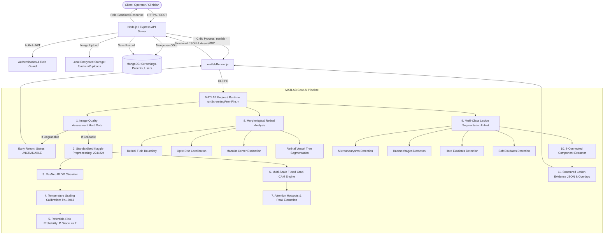

# RetinoScan AI — Final System Architecture & Technical Specification
**Version:** 1.0.0 (Phase 7 Final Architecture)  
**Date:** September 20, 2026  
**System:** RetinoScan AI Clinical Retinopathy Diagnostic Platform

---

## 1. High-Level System Architecture



---

## 2. Component Specifications

### 2.1 Image Quality Assessment (IQA) Hard Gate
- **Location:** `drScreen.m`, `assessImageQuality.m`
- **Methodology:**
  - **Focus / Sharpness:** Modified Laplacian variance with circular retinal aperture masking ($> 0.00008$).
  - **Illumination:** Active-retina mean luminance and dynamic range thresholding ($0.12 \le \mu \le 0.88$).
  - **Retinal FOV Ratio:** Circular fundus mask area relative to bounding frame ($> 0.35$).
- **Safety Action:** When any threshold fails, execution halts immediately. Output is flagged `status: 'UNGRADABLE'`, zero disease classifications are computed, and a clear message is returned: `"Please recapture the retinal image."`

### 2.2 Standardized Preprocessing & Classification
- **Location:** `preprocessKaggle.m`, `drScreen.m`
- **Model:** ResNet-18 fine-tuned on APTOS 2019 / Kaggle DR (`trained_dr_model_r18_final_candidate.mat`).
- **Input:** $224 \times 224 \times 3$, normalized $[0, 1]$, local contrast Graham-filtered.
- **Classes:**
  - `0`: No DR (Normal)
  - `1`: Mild Non-Proliferative DR
  - `2`: Moderate Non-Proliferative DR
  - `3`: Severe Non-Proliferative DR
  - `4`: Proliferative DR

### 2.3 Post-Hoc Probability Calibration
- **Location:** `AI_REBUILD/04_calibration/applyCalibration.m`
- **Parameters:** $T = 1.80632676766661$ (fitted via temperature scaling on held-out validation set).
- **Logits Calculation:** $z_i = \ln(p_i) - \frac{1}{K}\sum \ln(p_j)$
- **Calibrated Distribution:** $q_i = \frac{\exp(z_i / T)}{\sum \exp(z_j / T)}$
- **Referable-Risk Estimation:** $P(\text{Referable}) = \sum_{k=2}^4 q_k$

### 2.4 Multi-Scale Grad-CAM & Hotspots
- **Location:** `AI_REBUILD/06_explainability/generateImprovedGradCAM.m`, `extractAttentionHotspots.m`
- **Feature Layer:** `res5b_relu` (ResNet-18 final residual block).
- **Refinement:** Multi-scale feature map fusion, active retinal boundary clipping, continuous non-linear alpha transparency (low activations are 100% transparent; no diffuse blue fog).
- **Hotspots:** Extracted via local maximum filtering with 8-connectivity; outputs pixel coordinates, normalized coordinates, and relative activation strengths.

### 2.5 Retinal Anatomical Structure Analysis
- **Location:** `AI_REBUILD/07_retinal_analysis/runRetinalAnalysis.m`
- **Retinal Field:** Otsu thresholding + convex hull morphology; calculates field center, radius, and coverage ratio.
- **Optic Disc:** Circular Hough Transform + bright intensity peak matching; outputs centroid and boundary radius.
- **Macula:** Geometric vector projection from optic disc along horizontal temporal meridian ($2.5 \times \text{OD diameter}$) verified by green-channel dark depression peak.
- **Vessel Tree:** Inverted background subtraction on green channel with morphological line filtering.

### 2.6 Deep Lesion Segmentation Engine
- **Location:** `AI_REBUILD/07_retinal_analysis/lesion_engine/`
- **Model Architecture:** U-Net encoder-decoder (`best_lesion_unet.mat`) trained on official IDRiD ground-truth masks.
- **Channels:** 4 output channels representing:
  1. Microaneurysms (MA)
  2. Haemorrhages (HE)
  3. Hard Exudates (EX)
  4. Soft Exudates (SE)
- **Tiling Inference:** $256 \times 256$ sliding window inference with 64-pixel overlap and Hann window blending across ultra-high-resolution fundus images (up to $4288 \times 2848$).
- **Post-Processing:** Optic disc boundary masking to eliminate false positives on the reflective optic cup; pure-MATLAB 8-connected component extraction yielding area, bounding box, centroid, and average probability.

---

## 3. Backend & API Contract

### 3.1 Screening Result Schema
```json
{
  "status": "GRADABLE",
  "grade": 2,
  "confidence": 0.9837,
  "calibratedConfidence": 0.8392,
  "referable": true,
  "referral": "REFERABLE DR",
  "referableRiskProbability": 0.9196,
  "calibratedProbabilities": [0.0402, 0.0402, 0.8392, 0.0402, 0.0402],
  "calibration": {
    "calibrated": true,
    "temperature": 1.8063,
    "method": "TemperatureScaling"
  },
  "retinalAnalysis": {
    "retinalField": { "detected": true, "coverageRatio": 0.7467 },
    "opticDisc": { "detected": true, "centerX": 2087, "centerY": 1111, "radius": 75 },
    "macula": { "estimated": true, "centerX": 1866, "centerY": 1263 },
    "vessels": { "available": true, "vesselAreaRatio": 0.0879 },
    "hotspots": [ { "id": 1, "x": 1204, "y": 892, "score": 0.95 } ],
    "lesions": {
      "microaneurysms": { "detected": true, "count": 96, "totalArea": 12450 },
      "haemorrhages": { "detected": true, "count": 100, "totalArea": 45120 },
      "hardExudates": { "detected": true, "count": 77, "totalArea": 28900 },
      "softExudates": { "detected": true, "count": 100, "totalArea": 151339 }
    },
    "assets": {
      "originalFundus": ".../SYS_TEST_A_GRADE2_original_fundus.png",
      "gradcamOverlay": ".../SYS_TEST_A_GRADE2_gradcam_overlay.png",
      "retinalLandmarks": ".../SYS_TEST_A_GRADE2_retinal_landmarks.png",
      "lesionOverlay": ".../SYS_TEST_A_GRADE2_lesion_combined_overlay.png"
    },
    "disclaimer": "Lesion evidence represents model-predicted pixel segmentations trained on IDRiD; they do not constitute clinically confirmed diagnoses without qualified clinician review."
  }
}
```

### 3.2 Human Review Immutability Contract
When an ophthalmologist reviews a case, the original screening document is updated with:
```json
{
  "triage": {
    "status": "REVIEWED",
    "updatedAt": "2026-09-20T14:12:00.000Z"
  },
  "humanReview": {
    "reviewed": true,
    "reviewedBy": "dr.smith@retinoscan.org",
    "reviewedAt": "2026-09-20T14:12:00.000Z",
    "clinicianGrade": 2,
    "clinicianNotes": "Confirmed microaneurysms and hard exudates in macula vicinity.",
    "action": "REFERRAL_URGENT"
  }
}
```
All top-level AI prediction fields (`grade`, `confidence`, `calibratedProbabilities`, `retinalAnalysis`) remain completely unchanged and cryptographically verifiable.
