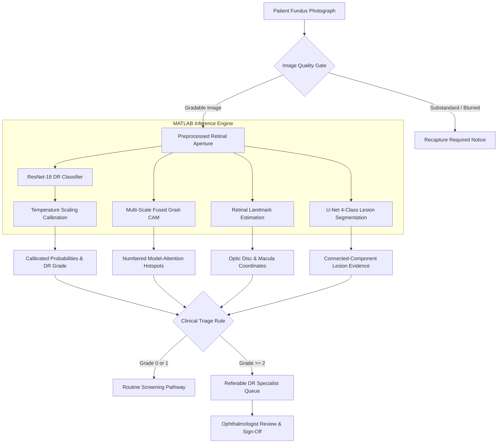
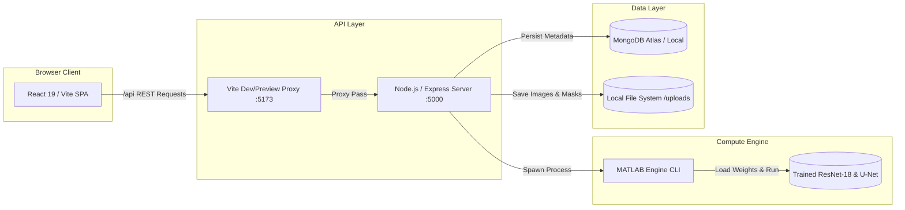

# RetinoScan AI

**Explainable AI-assisted diabetic retinopathy screening and clinical triage from retinal fundus photographs.**

*Developed for the Smart India Hackathon (SIH 2026).*

[](https://www.mathworks.com/products/matlab.html)
[](https://react.dev/)
[](https://nodejs.org/)
[](https://www.mongodb.com/)
[](#team)

---

## 1. Project Overview

Diabetic Retinopathy (DR) is a leading cause of preventable visual impairment and blindness among working-age adults worldwide. Timely screening is critical to prevent irreversible vision loss, yet access to specialized ophthalmologists remains severely constrained in rural and underserved community screening camps.

**RetinoScan AI** is an AI-assisted clinical decision-support and triage system designed to assist screening operators and ophthalmologists. The platform automates image quality assessment, performs 5-class severity grading, calibrates class probabilities, generates multi-scale model-attention maps (Grad-CAM), segments candidate retinal lesions, and routes referable cases to an ophthalmologist review workflow.

> [!IMPORTANT]
> **Decision Support Only:** RetinoScan AI is a computer-aided screening and triage tool designed to assist healthcare personnel. It is **not** an autonomous diagnostic system or cleared medical device. An ophthalmologist or qualified clinician remains the ultimate clinical decision-maker.

---

## 2. Key Features

* **Image Quality Assessment (IQA) Hard Gate:** Evaluates focus/blur (Laplacian variance), illumination/exposure, and retinal field of view. Substandard captures trigger an immediate recapture recommendation before inference.
* **5-Class DR Severity Grading:** Classifies fundus photographs according to the International Clinical Diabetic Retinopathy (ICDR) scale:
  * Grade 0: No DR
  * Grade 1: Mild Non-Proliferative DR (NPDR)
  * Grade 2: Moderate NPDR
  * Grade 3: Severe NPDR
  * Grade 4: Proliferative DR (PDR)
* **Clinical Triage & Routing:** Automatically triages patients:
  * Non-Referable (Grades 0–1): Routine annual screening pathway.
  * Referable (Grades $\ge 2$): Prompt referral for specialist ophthalmic review.
* **Calibrated Probability Vectors:** Employs post-hoc temperature scaling ($T = 1.8063$) to mitigate neural network overconfidence and provide reliable class probabilities.
* **Model Attention Hotspots (Grad-CAM):** Multi-scale geometric fusion of deep convolutional feature maps with 2D non-maximum suppression (NMS) highlighting regions influencing the classification decision.
* **Retinal Landmark Analysis:** Morphological estimation of the retinal aperture, optic disc localization, foveal/macular center estimation, and retinal blood vessel contrast.
* **Lesion Semantic Segmentation:** Deep U-Net segmentation isolating 4 distinct DR lesion categories: Microaneurysms (MA), Haemorrhages (HE), Hard Exudates (EX), and Soft Exudates / Cotton-Wool Spots (SE).
* **Clinical Review Queue & Persistence:** Operator screening queues, doctor pending review management, structured diagnostic reports, and audit trails persisted in MongoDB.

> [!NOTE]
> **Model Attention vs. Lesion Segmentation:** Grad-CAM reflects **model attention hotspots** (salient pixel regions influencing the classifier) and does not constitute proof of lesion localization. Pixel-level lesion boundaries are separately delineated by the semantic segmentation U-Net engine.

---

## 3. System Architecture & Workflow

### Clinical Screening Pipeline



### Full-Stack Architecture



---

## 4. Screening Workflow

1. **Patient Registration:** The operator inputs patient demographics (ID, name, age, gender, duration of diabetes).
2. **Fundus Image Upload:** Digital color fundus photograph is ingested via file upload.
3. **Quality Verification:** Automated IQA inspects focus, illumination, and field-of-view ratio. If the image is ungradable, processing stops and the operator is prompted to recapture.
4. **AI Screening Execution:** If gradable, the image is passed to the MATLAB inference bridge (`runScreeningFromFile.m`).
5. **Severity Grading & Calibration:** Model produces raw logits, calibrated class probabilities, and predicted ICDR severity (Grade 0–4).
6. **Attention & Lesion Evidence:** Multi-scale Grad-CAM highlights decision hotspots; the lesion U-Net produces masks and component counts for MA, HE, EX, and SE.
7. **Triage Recommendation:**
   * **Grade 0–1 (Non-Referable):** Routine annual recall recommended.
   * **Grade $\ge 2$ (Referable):** Immediate routing flag generated.
8. **Specialist Review Workflow:** Referable cases populate the doctor's review queue. The ophthalmologist inspects original fundus images, Grad-CAM overlays, lesion evidence, and submits a final clinical assessment.

---

## 5. AI Pipeline Details

### Image Quality Assessment (IQA)
* **Focus & Sharpness:** Modified Laplacian operator variance calculated across the high-contrast retinal mask ($\ge 0.005$).
* **Illumination & Exposure:** Mean intensity and saturation distribution checks to reject underexposed or overexposed images.
* **Retinal Field Coverage:** Morphological aperture detection requiring active retinal mask coverage $\ge 50\%$ of the image area.

### DR Severity Classification
* **Backbone:** Convolutional neural network based on ResNet-18 (`R18-FINAL-CANDIDATE`).
* **Input Resolution:** $224 \times 224 \times 3$ preprocessed fundus images (retinal circular cropping, border noise removal, local contrast normalization).
* **Output:** 5-class logits mapped to ICDR grades 0 through 4.

### Probability Calibration
Deep networks frequently produce overconfident probability estimates. RetinoScan AI implements **temperature scaling** on an isolated calibration partition ($N = 550$):

$$\hat{p}_i = \frac{\exp(z_i / T)}{\sum_{j=0}^4 \exp(z_j / T)}, \quad T^* = 1.8063$$

* **Expected Calibration Error (ECE):** Reduced from **0.0900** to **0.0345** ($-61.7\%$ relative error).
* **Multi-Class Brier Score:** Reduced from **0.3131** to **0.2939**.
* **Log Loss:** Reduced from **0.6287** to **0.5473**.

### Multi-Scale Grad-CAM (Model Attention)
* **Geometric Feature Fusion:** Fuses semantic activation from late layer `res5b_relu` ($7 \times 7$) with structural spatial details from intermediate layer `res4b_relu` ($14 \times 14$):
  
  $$M_{\text{fused}}(x, y) = \sqrt{\text{Norm}(M_{\text{res5b}}(x, y)) \odot \text{Norm}(M_{\text{res4b}}(x, y))}$$

* **Focal Sharpening:** Contrast exponentiation $M_{\text{focal}} = (M_{\text{fused}})^{1.2}$ suppresses background tissue haze.
* **Greedy 2D NMS:** Extracts distinct local maxima to identify numbered **Model Attention Hotspots** with localized bounding contours, bounded strictly within the retinal field.

### Retinal Landmark Localization
* **Optic Disc (OD):** Estimated using circular Hough transform and brightest vascular convergence peak detection.
* **Macula / Fovea:** Anatomically referenced relative to the optic disc vector (approximately 2.5 disc diameters temporal) and green-channel foveal avascular depression.
* **Vessel Architecture:** Matched filter morphological vessel contrast extraction.

### Lesion Semantic Segmentation
* **Architecture:** 3-level U-Net encoder-decoder implemented via MATLAB Deep Learning Toolbox (`dlnetwork`) with 483,492 parameters.
* **Input:** Multi-tile $256 \times 256$ sampled patches from $2144 \times 1424$ half-scale fundus photographs.
* **Supported Lesion Classes:**
  1. Microaneurysms (MA)
  2. Haemorrhages (HE)
  3. Hard Exudates (EX)
  4. Soft Exudates / Cotton-Wool Spots (SE)
* **Output Formulation:** Tiled overlapping inference with 2D Bartlett window blending, generating binary segmentation masks and connected-component structured clinical evidence tables.

---

## 6. Datasets

The models were trained and benchmarked on established open-access retinal datasets:

| Dataset | Sample Size | Modality | Primary Use in RetinoScan AI |
| :--- | :---: | :--- | :--- |
| **APTOS 2019 Blindness Detection** | 3,662 images | Color Fundus Photography | 5-class DR classification, validation, calibration, and held-out evaluation |
| **Indian Diabetic Retinopathy Image Dataset (IDRiD)** | 81 images (54 train / 27 test) | High-Resolution Color Fundus | Pixel-level lesion semantic segmentation (MA, HE, EX, SE) |

> [!NOTE]
> Training datasets are hosted independently by their respective consortia and are **not** distributed inside this Git repository.

---

## 7. Model Performance

All classification metrics are reported on the canonical **held-out test set ($N = 548$)** of unseen fundus images. No test images were used during training, hyperparameter search, or temperature calibration.

### Classification Performance (Canonical Held-Out Test Set, $N = 548$)

| Evaluation Metric | Value | Context |
| :--- | :---: | :--- |
| **Overall Accuracy** | **76.09%** | 417 / 548 test images |
| **Quadratic Weighted Kappa (QWK)** | **0.8509** | High ordinal agreement across 5 ICDR classes |
| **Macro F1-Score** | **0.5861** | Balanced across imbalanced severity classes |
| **Referable DR Sensitivity** ($\text{Grade} \ge 2$) | **79.46%** | 178 / 224 referable patients identified at default threshold |
| **Referable DR Specificity** ($\text{Grade} < 2$) | **96.60%** | 313 / 324 non-referable patients correctly classified |
| **Referable DR Precision (PPV)** | **94.18%** | 178 / 189 referral recommendations verified referable |
| **Referable DR ROC-AUC** | **0.9753** | Area under the receiver operating characteristic |
| **Grade 0 (No DR) Recall** | **97.79%** | 265 / 271 normal eyes correctly identified |
| **Grade 1 (Mild NPDR) Recall** | **64.15%** | 34 / 53 mild cases identified |
| **Grade 2 (Moderate NPDR) Recall** | **57.89%** | 88 / 152 moderate cases identified |
| **Grade 3 (Severe NPDR) Recall** | **37.04%** | 10 / 27 severe cases captured |
| **Grade 4 (Proliferative DR) Recall** | **44.44%** | 20 / 45 proliferative cases captured |

### Lesion Segmentation Performance (Official IDRiD Test Partition, $N = 27$)

| Lesion Class | Annotated Test Images | Mean Dice | IoU (Jaccard) | Sensitivity | Specificity | Precision |
| :--- | :---: | :---: | :---: | :---: | :---: | :---: |
| **Hard Exudates (EX)** | 27 / 27 | **0.6361** | 0.4819 | 0.6196 | 0.9971 | 0.7138 |
| **Microaneurysms (MA)** | 27 / 27 | **0.3830** | 0.2405 | 0.4749 | 0.9987 | 0.3376 |
| **Haemorrhages (HE)** | 27 / 27 | **0.2639** | 0.1596 | 0.4412 | 0.9857 | 0.2415 |
| **Soft Exudates (SE)** | 14 / 27 | **0.1047** | 0.0757 | 0.0888 | 0.9807 | 0.2905 |

*Note on Soft Exudates (SE):* Soft exudates represent a documented small-dataset constraint (only 40 total annotated images across IDRiD). Reported performance reflects genuine holdout metrics without inflation.

---

## 8. Technology Stack

| Component | Technology | Role |
| :--- | :--- | :--- |
| **Frontend** | React 19, Vite, TailwindCSS / CSS Modules | Operator and doctor web interfaces |
| **Backend** | Node.js (v18+ LTS), Express.js | API routing, file storage, MATLAB orchestration |
| **Database** | MongoDB / Mongoose ODM | Screening records, clinician reviews, audit history |
| **AI Runtime** | MATLAB R2026a (or compatible) | Execution engine for deep learning and image processing |
| **Toolboxes** | Deep Learning Toolbox, Image Processing Toolbox | Neural network inference, morphological operations |
| **Classification Model** | ResNet-18 (`R18-FINAL-CANDIDATE`) | 5-class DR classification (`trained_dr_model.mat`) |
| **Segmentation Model** | 3-Level U-Net (`dlnetwork`) | 4-class semantic lesion segmentation |
| **Hardware** | NVIDIA CUDA GPU (optional, CPU supported) | Hardware acceleration for inference |

---

## 9. Repository Structure

```
SIH_Dataset/
├── backend/                  # Node.js & Express API bridge
│   ├── src/                  # Controllers, routes, middleware, and models
│   ├── uploads/              # Local runtime directory for uploaded/generated assets
│   ├── package.json
│   └── .env.example          # Backend environment configuration template
├── frontend/                 # React & Vite client application
│   ├── src/                  # Pages (operator/doctor), components, services
│   ├── vite.config.js        # Vite dev and preview proxy configuration
│   ├── package.json
│   └── .env.example          # Frontend environment template
├── AI_REBUILD/               # Core machine learning research and engineering
│   ├── 02_training/          # ResNet-18 model weights, training configs, metadata
│   ├── 03_evaluation/        # Held-out evaluation scripts and benchmark reports
│   ├── 04_calibration/       # Temperature scaling calibration and test scripts
│   ├── 06_explainability/    # Multi-scale Grad-CAM engine and validation code
│   ├── 07_retinal_analysis/  # U-Net lesion segmentation engine and IDRiD pipeline
│   ├── 08_final_validation/  # System integration tests and limitation documentation
│   └── 09_release/           # Deployment guides and architecture documentation
├── demo_data/                # Sample fundus images for live screening demonstration
├── runScreeningFromFile.m    # Unified MATLAB CLI entry point for backend execution
├── drScreen.m                # Core MATLAB screening orchestrator
├── start-retinoscan.bat      # One-click Windows launch script
├── stop-retinoscan.bat       # One-click Windows shutdown script
└── README.md
```

---

## 10. Installation & Setup

### Prerequisites
* **Operating System:** Windows 10/11 (64-bit)
* **Node.js:** v18+ LTS and `npm`
* **MATLAB:** R2026a (or compatible) with:
  * Deep Learning Toolbox
  * Image Processing Toolbox
* **MongoDB:** Local MongoDB Community instance or MongoDB Atlas URI
* **GPU (Optional):** NVIDIA GPU with CUDA support for accelerated inference

### Step 1: Clone Repository
```bash
git clone https://github.com/aditya-codes-git/SIH_Dataset.git
cd SIH_Dataset
```

### Step 2: Configure Environment Files
1. **Backend Configuration:**
   ```bash
   copy backend\.env.example backend\.env
   ```
   Edit `backend/.env` to configure your MongoDB connection and MATLAB executable path:
   ```ini
   PORT=5000
   MONGODB_URI=mongodb://localhost:27017/retinoscan
   MATLAB_CMD=matlab
   ```

2. **Frontend Configuration:**
   ```bash
   copy frontend\.env.example frontend\.env
   ```
   Default settings configure relative proxy routing:
   ```ini
   VITE_API_BASE_URL=/api
   ```

### Step 3: Install Dependencies
```bash
# Install backend dependencies
cd backend
npm install

# Install frontend dependencies
cd ../frontend
npm install
cd ..
```

---

## 11. Running the Application

### One-Click Startup (Recommended on Windows)
Run the automated startup script from the root directory:
```cmd
start-retinoscan.bat
```
This script validates Node.js, npm, and MATLAB, creates local upload directories, initializes both backend and frontend servers, and launches the application in your browser.

* **Frontend Web Application:** [http://localhost:5173](http://localhost:5173)
* **Backend API Health Check:** [http://localhost:5000/api/health](http://localhost:5000/api/health)

### Stopping the Services
```cmd
stop-retinoscan.bat
```

### Manual Service Startup
If running services individually in separate terminals:
```bash
# Terminal 1: Backend
cd backend
npm start

# Terminal 2: Frontend
cd frontend
npm run dev
```

---

## 12. Remote Demonstration (Cloudflare Quick Tunnel)

For temporary remote demonstrations, expose the local Vite development server via Cloudflare Quick Tunnel:
```bash
cloudflared tunnel --url http://localhost:5173
```
* Traffic flows securely: **Cloudflare Edge $\to$ Vite Dev Server (:5173) $\to$ `/api` Reverse Proxy $\to$ Express (:5000) $\to$ MATLAB Inference $\to$ MongoDB**.
* *Note:* Quick Tunnels provide temporary session URLs and require the host machine to remain active.

---

## 13. Clinical Review Workflow

RetinoScan AI separates operational screening from clinical evaluation:

1. **Operator Interface:** Designed for primary care workers and technicians. Facilitates patient intake, image upload, quality gate verification, and review of screening completion status.
2. **Doctor Interface:** Restricted specialist interface. Ophthalmologists review triage queues, examine interactive Grad-CAM attention hotspots alongside side-by-side lesion segmentation overlays, inspect candidate bounding boxes, and enter signed clinical decisions (*Agree / Disagree / Request OCT*).
3. **Audit Trail:** AI outputs are immutable; clinician reviews, edits, and timestamps are recorded separately in MongoDB.

---

## 14. Limitations & Clinical Boundaries

* **Prototype Status:** RetinoScan AI is a research and clinical decision-support prototype. It has not received regulatory clearance (such as US FDA, CE-IVD, or CDSCO).
* **Domain Adaptation:** Evaluated on standard 45°–50° color fundus photography (APTOS and IDRiD). Performance on handheld smartphone fundus adapters, ultra-widefield imaging, or non-mydriatic cameras with optical aberrations may vary.
* **Explainability Boundaries:** Grad-CAM displays **statistical model attention** (salient regions influencing classification). It must not be interpreted as anatomical proof of specific lesion pathology.
* **Macular Edema:** Detection of hard exudates indicates high risk of Diabetic Macular Edema (DME). Definitive DME diagnosis requires optical coherence tomography (OCT) to measure retinal thickness.
* **Clinical Oversight:** All outputs require human clinical interpretation before initiating patient treatment.

---

## 15. Repository & Data Notes

* **Large Training Assets Excluded:** To comply with GitHub repository limits and licensing terms, large raw training datasets (`train_images/`, `IDRID/`) and large intermediate training patch files (`lesion_patches.mat`, ~155 MB) are excluded from version control via `.gitignore`.
* **Inference Models Included:** All production-ready trained model weights required for inference (`trained_dr_model.mat`, ~39.8 MB; `final_lesion_unet.mat`, ~1.7 MB) are tracked directly in Git, allowing the application to run out-of-the-box.
* **Regeneration:** Excluded training caches can be regenerated from the respective raw datasets using `extractLesionPatches.m`.

---

## 16. Team

**Team Null Pointer**  
*Smart India Hackathon 2026*

* **Aditya Pharande**
* **Neha Kedar**
* **Uzma Tamboli**
* **Akshay Ghule**
* **Rohit Pasle**
* **Saujanya Gupta**

---

## 17. Acknowledgements

* **APTOS 2019 Blindness Detection:** Asia Pacific Tele-Ophthalmology Society (APTOS) and Kaggle for the fundus benchmark dataset.
* **IDRiD Dataset:** Indian Diabetic Retinopathy Image Dataset (Prasanna Porwal et al.) for high-resolution lesion segmentation ground truths.
* **MathWorks:** MATLAB Deep Learning Toolbox and Image Processing Toolbox.
* **Smart India Hackathon:** Ministry of Education's Innovation Cell, Government of India.

---

## 18. License

Licensing information has not yet been specified. Developed for Smart India Hackathon (SIH 2026).
