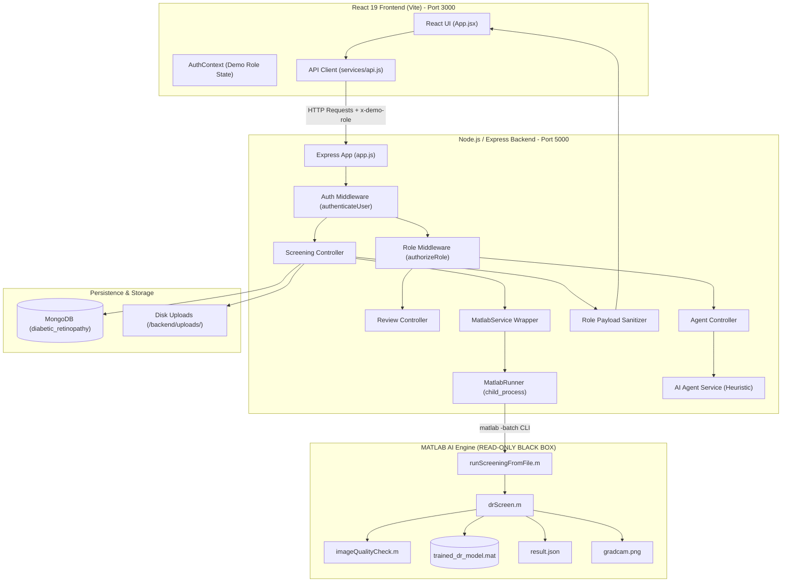
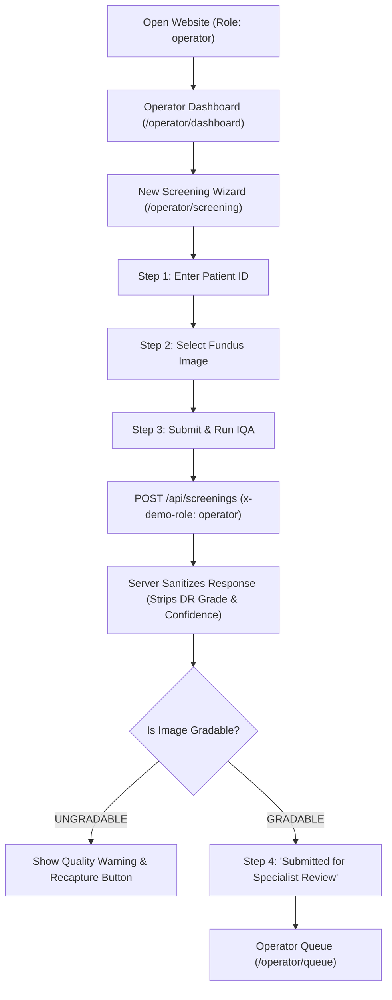
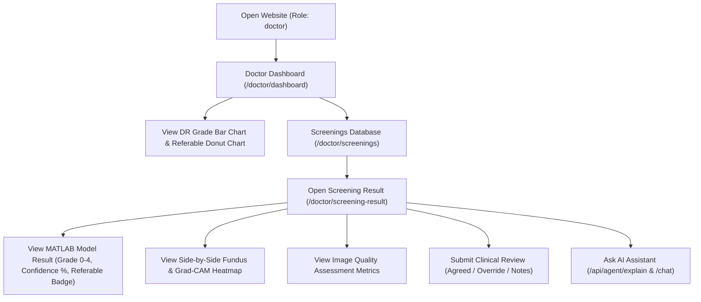
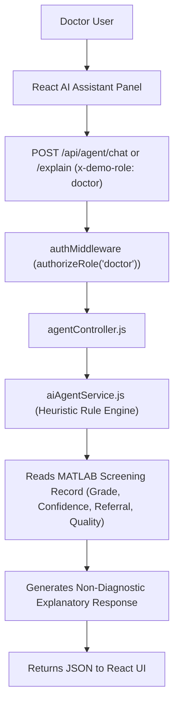
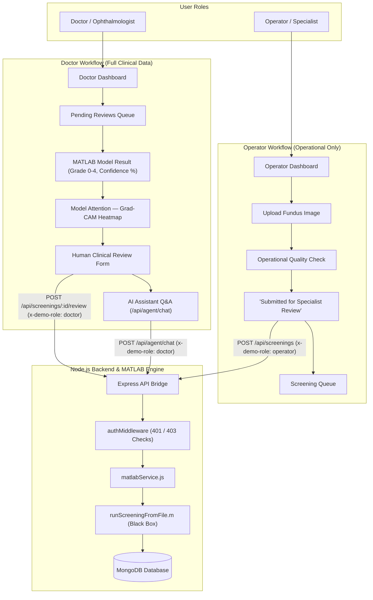

# RetinoScan AI — Complete Website Flow & Architecture Audit

**Document Version:** 1.0.0  
**Audit Date:** September 3, 2026  
**Target Repository:** `d:/SIH_Dataset`  
**Purpose:** Comprehensive technical audit of the **ACTUAL CURRENT WEBSITE FLOW** and architecture as implemented in the source code.

---

## 1. System Overview

RetinoScan AI is built as a three-tier medical decision-support application connecting a React frontend, a Node.js/Express backend, a MongoDB database, and an isolated read-only MATLAB AI screening pipeline.

### Actual Architecture Diagram



---

## 2. Complete User Flow

### Step 1: Initial Application Load
- **Page/Component:** `App.jsx` wrapping `Layout.jsx`, `Sidebar.jsx`, `Header.jsx`.
- **Role:** Evaluated from `AuthContext` (reads `localStorage.getItem('retinoscan_demo_role')`, defaulting to `'doctor'`).
- **User Actions:** Can view active navigation items, toggle theme (Light/Dark), or switch roles using the **DEMO ROLE MODE** switcher in the sidebar footer.
- **API Called:** `GET /api/health` and `GET /api/screenings` (with `x-demo-role` header).
- **Data Sent:** `x-demo-role: operator` or `x-demo-role: doctor`.
- **Data Returned:**
  - `/api/health`: `{ status: "OK", database: { status: "CONNECTED" }, matlabModel: { status: "READY" } }`.
  - `/api/screenings`: Array of screening records, server-sanitized according to requesting role.
- **Next Step:** Render role-specific dashboard.

---

## 3. Operator Flow

### Actual Implementation Audit



### Operator Route & Component Mapping
- **Dashboard Route:** `operator-dashboard` $\rightarrow$ `OperatorDashboard.jsx`
- **New Screening Route:** `operator-screening` $\rightarrow$ `OperatorScreening.jsx`
- **Queue Route:** `operator-queue` $\rightarrow$ `OperatorQueue.jsx`
- **Patients Route:** `operator-patients` $\rightarrow$ `OperatorPatients.jsx`
- **Backend Endpoint:** `POST /api/screenings` and `GET /api/screenings`

### Server-Side Data Privacy Verification

| Field / Feature | Accessible to Operator? | Verification Method (Code Audit) |
| :--- | :---: | :--- |
| **DR Grade (0–4)** | ❌ **NO** | Sanitized in `roleSanitizer.js:21` (`drGrade` omitted) |
| **Predicted Class** | ❌ **NO** | Sanitized in `roleSanitizer.js:21` (`predictedClass` omitted) |
| **Model Confidence %** | ❌ **NO** | Sanitized in `roleSanitizer.js:21` (`confidence` omitted) |
| **Referable Status** | ❌ **NO** | Sanitized in `roleSanitizer.js:21` (`referable` omitted) |
| **Referral String** | ❌ **NO** | Sanitized in `roleSanitizer.js:21` (`referral` omitted) |
| **Grad-CAM Heatmap URL** | ❌ **NO** | Sanitized in `roleSanitizer.js:21` (`gradcamUrl` omitted) & blocked in `fileRoutes.js:21` (403 Forbidden) |
| **Human Review Form** | ❌ **NO** | Blocked in `reviewRoutes.js:7` (403 Forbidden) |
| **AI Assistant** | ❌ **NO** | Blocked in `agentRoutes.js:7` (403 Forbidden) |
| **Doctor Notes** | ❌ **NO** | Sanitized in `roleSanitizer.js:21` (`humanReview` omitted) |
| **Operational Quality Reason** | ✅ **YES** | Preserved in `roleSanitizer.js:15` (`quality.reason`, `focusScore`, `brightness`, `fovRatio`) |

---

## 4. Doctor Flow

### Actual Implementation Audit



### Doctor Route & Component Mapping
- **Dashboard Route:** `doctor-dashboard` $\rightarrow$ `Dashboard.jsx` (Doctor version)
- **Screenings Database Route:** `doctor-screenings` $\rightarrow$ `Screenings.jsx`
- **Screening Result Route:** `doctor-screening-result` $\rightarrow$ `ScreeningResult.jsx`
- **Pending Reviews Route:** `doctor-pending-reviews` $\rightarrow$ `DoctorPendingReviews.jsx`
- **Patients Registry Route:** `doctor-patients` $\rightarrow$ `Patients.jsx` & `PatientDetails.jsx`
- **AI Assistant Page Route:** `doctor-assistant` $\rightarrow$ `AssistantPage.jsx`
- **Backend Endpoints:**
  - `GET /api/screenings/:id` (Returns full clinical payload)
  - `POST /api/screenings/:id/review` (Submits clinician review)
  - `POST /api/agent/explain` & `POST /api/agent/chat` (Returns explanatory AI summaries)

---

## 5. Screening Pipeline

### Technical Execution Sequence

```mermaid
sequenceDiagram
    autonumber
    participant React as React Frontend
    participant Express as Express (screeningController)
    participant Multer as Multer Middleware
    participant Disk as File Storage (/uploads/)
    participant Runner as matlabRunner.js
    participant MATLAB as MATLAB CLI (matlab -batch)
    participant Script as runScreeningFromFile.m
    participant Model as drScreen.m & trained_dr_model.mat
    participant Mongo as MongoDB Database
    participant Sanitizer as roleSanitizer.js

    React->>Express: POST /api/screenings (multipart image + x-demo-role)
    Express->>Multer: Parse & validate file mimetype
    Multer->>Disk: Write original image to /uploads/original/{uuid}.png
    Express->>Runner: runMatlabScreening(inputPath, outputPath, gradcamPath)
    Runner->>MATLAB: Spawn process: matlab -batch "addpath(...); runScreeningFromFile(...)"
    MATLAB->>Script: Execute runScreeningFromFile(input, output, gradcam)
    Script->>Model: Call drScreen(img) -> imageQualityCheck(img) -> classify(trainedNet) -> gradCAM()
    Model->>Disk: Export Grad-CAM to /uploads/gradcam/{uuid}_gradcam.png
    Script->>Disk: Write result JSON to /uploads/results/{uuid}_result.json
    Runner->>Express: Parse result JSON & verify Grad-CAM file
    Express->>Mongo: Save Screening model document
    Express->>Sanitizer: sanitizeScreening(rawPayload, userRole)
    Sanitizer-->>React: Return HTTP 201 JSON (Sanitized for Operator / Full for Doctor)
```

---

## 6. Image Quality Flow

### Implementation Detail (`imageQualityCheck.m` & `drScreen.m`)

1. **Focus / Sharpness Check:**
   - Computes 2D Laplacian variance on grayscale image: `focusScore = var(lap(:))`.
   - Threshold: `focusScore >= 0.00008`.
2. **Illumination / Brightness Check:**
   - Computes mean intensity: `brightness = mean(gray(:))`.
   - Threshold: `0.08 <= brightness <= 0.40`.
3. **Retinal Field of View Check:**
   - Computes FOV area ratio: `fovRatio = mean(gray(:) > 0.05)`.
   - Threshold: `fovRatio >= 0.45`.
4. **Final Decision:**
   - `gradable = focusOK && brightnessOK && fovOK`.
   - If `~gradable`: `drScreen.m` sets `status = "UNGRADABLE"`, constructs explanation `reason` (e.g. `"Poor focus / blurry image; Poor illumination"`), and returns immediately without running DR neural network classification or Grad-CAM.

---

## 7. MATLAB Model Boundary

> [!IMPORTANT]
> **Zero Modification Verification**  
> Inspection of `matlabRunner.js`, `matlabService.js`, and `screeningController.js` confirms that **NO model outputs are modified, recalculated, normalized, or transformed by Node.js**.

- `drGrade` is cast to Number: `Number(matlabData.grade)` $\rightarrow$ **PRESERVED**
- `confidence` is cast to Number: `Number(matlabData.confidence)` $\rightarrow$ **PRESERVED**
- `referable` is cast to Boolean: `Boolean(matlabData.referable)` $\rightarrow$ **PRESERVED**
- `referral` is cast to String: `String(matlabData.referral)` $\rightarrow$ **PRESERVED**
- `quality` scores (`focusScore`, `brightness`, `fovRatio`) $\rightarrow$ **PRESERVED**
- `gradcam.png` exported directly by MATLAB `exportgraphics` $\rightarrow$ **PRESERVED**

---

## 8. Role-Based Data Boundary Matrix

| Data Element | Operator Received (Backend Payload) | Doctor Received (Backend Payload) |
| :--- | :---: | :---: |
| **Screening ID & Patient ID** | ✅ Yes | ✅ Yes |
| **Original Fundus Image URL** | ✅ Yes | ✅ Yes |
| **Status (GRADABLE / UNGRADABLE)** | ✅ Yes | ✅ Yes |
| **Quality Status & Reason** | ✅ Yes | ✅ Yes |
| **Quality Numeric Scores** | ✅ Yes | ✅ Yes |
| **DR Grade (0–4)** | ❌ **NO (Stripped)** | ✅ Yes |
| **Predicted Class** | ❌ **NO (Stripped)** | ✅ Yes |
| **Confidence Score** | ❌ **NO (Stripped)** | ✅ Yes |
| **Referable Status (Boolean)** | ❌ **NO (Stripped)** | ✅ Yes |
| **Referral String** | ❌ **NO (Stripped)** | ✅ Yes |
| **Grad-CAM Image URL** | ❌ **NO (Stripped & 403)** | ✅ Yes |
| **Human Review Record** | ❌ **NO (Stripped & 403)** | ✅ Yes |
| **Doctor Review Form Submission** | ❌ **NO (403 Forbidden)** | ✅ Yes |
| **AI Assistant (/explain & /chat)** | ❌ **NO (403 Forbidden)** | ✅ Yes |

---

## 9. API Flow & Authorization Matrix

| Method | Route | Authorized Roles | Input | Output | Purpose |
| :--- | :--- | :--- | :--- | :--- | :--- |
| `GET` | `/api/health` | Public | None | Health JSON | Server & DB health check |
| `POST` | `/api/screenings` | Operator, Doctor | `multipart/form-data` (`image`, `patientId`) | Sanitized Screening JSON | Upload image & run MATLAB AI |
| `GET` | `/api/screenings` | Operator, Doctor | Query params | Sanitized Array of Screenings | List screenings |
| `GET` | `/api/screenings/:id` | Operator, Doctor | `:id` param | Sanitized Screening JSON | Fetch single screening record |
| `POST` | `/api/screenings/:id/review` | **Doctor ONLY** | `{ reviewer, decision, notes }` | Updated Screening JSON | Submit clinician review |
| `POST` | `/api/agent/explain` | **Doctor ONLY** | `{ screeningId, screeningData }` | Explanation JSON | Get AI screening explanation |
| `POST` | `/api/agent/chat` | **Doctor ONLY** | `{ prompt, screeningId }` | Chat Reply JSON | Conversational Q&A on screening |
| `GET` | `/api/files/original/:filename` | Operator, Doctor | `:filename` | Image binary | Serve uploaded fundus image |
| `GET` | `/api/files/gradcam/:filename` | **Doctor ONLY** | `:filename` | Image binary | Serve Grad-CAM heatmap |

---

## 10. AI Agent Flow



### Audit Findings for AI Agent
- **LLM Configuration:** `NOT IMPLEMENTED` (Uses local deterministic heuristic rule engine in `aiAgentService.js`).
- **Receives Image Directly?** ❌ **NO** (Receives only structured JSON metrics).
- **Receives MATLAB Results?** ✅ **YES** (Grade, confidence, referable, quality scores).
- **Can Modify Model Results?** ❌ **NO** (Read-only explanation generator).
- **Safety Restrictions:** Strictly hardcoded disclaimers; refuses independent diagnosis.

---

## 11. Database Flow

MongoDB database `diabetic_retinopathy` stores screening records under `screenings` collection using `Screening.js` Mongoose schema.

```json
{
  "screeningId": "aaac19a2-2970-4b58-a5f2-86bcb850c8ff",
  "patientId": "PATIENT-APTOS-001",
  "originalImagePath": "D:\\SIH_Dataset\\backend\\uploads\\original\\aaac19a2.png",
  "status": "GRADABLE",
  "quality": {
    "gradable": true,
    "reason": "Image quality acceptable. Proceed to DR screening.",
    "focusScore": 0.00013289657503073293,
    "brightness": 0.20139522684675956,
    "fovRatio": 0.745628860612667
  },
  "drGrade": 0,
  "predictedClass": "0",
  "confidence": 0.9502028226852417,
  "referable": false,
  "referral": "NON-REFERABLE DR",
  "gradcamImagePath": "aaac19a2_gradcam.png",
  "humanReview": {
    "reviewed": true,
    "reviewer": "Dr. Sarah Jenkins, MD",
    "decision": "Agreed",
    "notes": "Normal macular architecture."
  }
}
```

---

## 12. File Flow

```
Uploaded Image -> backend/uploads/original/{screeningId}.png -> MATLAB imread()
                                                                       │
                                                                       ▼
MATLAB exportgraphics() -> backend/uploads/gradcam/{screeningId}_gradcam.png
                                                                       │
                                                                       ▼
MATLAB jsonencode() -> backend/uploads/results/{screeningId}_result.json
```

---

## 13. Error Flows Audit

| Error Scenario | Implemented Behavior | Status |
| :--- | :--- | :---: |
| **1. Invalid Image Mimetype** | Multer rejects file with `400 Bad Request` ("Invalid image file type"). | **IMPLEMENTED** |
| **2. Image > 50MB** | Multer limits file size and returns `400 Bad Request`. | **IMPLEMENTED** |
| **3. Ungradable Image** | MATLAB sets `status = "UNGRADABLE"`. Backend returns `UNGRADABLE` JSON. Frontend displays `UngradableWarning` card. | **IMPLEMENTED** |
| **4. MATLAB CLI Failure** | `matlabRunner.js` catches process timeout/error, rejects promise, returns `500 Internal Server Error`. | **IMPLEMENTED** |
| **5. MongoDB Unavailable** | `connectDB()` catches connection error. Backend processes screening and returns `dbPersisted: false`. | **IMPLEMENTED** |
| **6. AI Agent Failure** | Catch block in `agentController.js` passes error to `errorHandler.js` returning structured JSON error. | **IMPLEMENTED** |
| **7. Invalid Screening ID** | Returns `404 Not Found` (`"Screening with ID not found"`). | **IMPLEMENTED** |
| **8. Unauthorized Operator Request** | `authMiddleware.js` catches unauthorized role, returns `403 Forbidden`. | **IMPLEMENTED** |
| **9. Unauthenticated Request** | `authMiddleware.js` catches missing `x-demo-role`, returns `401 Unauthorized`. | **IMPLEMENTED** |

---

## 14. Security Audit Summary

| Item | Status | Details |
| :--- | :---: | :--- |
| **Authentication** | **PARTIALLY IMPLEMENTED** | Header-based demo session (`x-demo-role`). Real JWT/OAuth is `NOT IMPLEMENTED`. |
| **Role Authorization** | **IMPLEMENTED** | `authorizeRole('doctor')` middleware blocks Operators from diagnostic APIs (`403`). |
| **Unauthenticated Protection** | **IMPLEMENTED** | Missing role header returns `401 Unauthorized`. |
| **Operator Data Sanitization** | **IMPLEMENTED** | `roleSanitizer.js` strips DR grades, confidence, referable status, and Grad-CAM server-side. |
| **Doctor Access** | **IMPLEMENTED** | Doctor receives full clinical payload upon authorization. |
| **Grad-CAM File Protection** | **IMPLEMENTED** | `/api/files/gradcam/:filename` requires Doctor role authorization (`403` for Operators). |
| **Environment Variables** | **IMPLEMENTED** | Configured in `backend/.env` (`PORT`, `MONGODB_URI`, `MATLAB_CMD`). |
| **CORS** | **IMPLEMENTED** | Enabled via `cors()` middleware in `app.js`. |
| **Helmet Security Headers** | **IMPLEMENTED** | Configured with `crossOriginResourcePolicy` in `app.js`. |

---

## 15. Actual vs Intended Flow Matrix

| Feature | Intended Behavior | Actually Implemented | Status |
| :--- | :--- | :--- | :---: |
| **Operator Dashboard** | Operational stats only, no grades | Shows operational counters & queue | **IMPLEMENTED** |
| **Operator Data Restriction** | Server-side sanitization of DR grade/confidence | `roleSanitizer.js` strips diagnostic fields | **IMPLEMENTED** |
| **Operator IQA Feedback** | Focus/Illumination/FOV operational feedback | Displayed in `OperatorScreening.jsx` | **IMPLEMENTED** |
| **Doctor Dashboard** | Diagnostic stats, bar charts, donut charts | Recharts DR grade distribution & referable charts | **IMPLEMENTED** |
| **MATLAB Model Result** | Explicit MATLAB output display | `ModelResultCard.jsx` displaying grade & confidence | **IMPLEMENTED** |
| **Grad-CAM Visual Explainability**| Doctor-only side-by-side view | `ImageComparison.jsx` with lightbox preview | **IMPLEMENTED** |
| **Human Clinical Review** | Separate clinician decision storage | `ClinicalReviewForm.jsx` submitting to `/review` | **IMPLEMENTED** |
| **AI Assistant** | Doctor-only contextual Q&A | `AIAssistantPanel.jsx` & `/api/agent/chat` | **IMPLEMENTED** |
| **Authentication** | Real JWT / OAuth user login | Header-based Demo Session (`x-demo-role`) | **PARTIALLY IMPLEMENTED** |
| **LLM AI Engine** | Production Cloud LLM integration | Heuristic rule-based engine in `aiAgentService.js` | **PARTIALLY IMPLEMENTED** |

---

## 16. Possible Architectural Problems Audit

### 1. Header-Based Demo Role Authentication
- **Severity:** **MEDIUM** (For SIH prototype demo) / **HIGH** (For production)
- **Description:** Authentication relies on client-provided `x-demo-role` header. While perfect for prototype demonstrations, production deployment will require token-based authentication (JWT/OAuth).

### 2. Heuristic Local AI Agent Engine
- **Severity:** **LOW**
- **Description:** `aiAgentService.js` uses deterministic rule matching rather than an external LLM API. Works reliably without API keys, but response flexibility is constrained to predefined templates.

---

## 17. RECOMMENDED FLOW — FOR REVIEW ONLY

```
OPERATOR WORKFLOW:
Login -> Operator Dashboard -> Patient Lookup -> Capture Fundus Image -> Operational IQA -> "Submitted for Specialist Review"

DOCTOR WORKFLOW:
Login -> Doctor Dashboard -> Pending Reviews -> Screening Result (Grade + Confidence + Grad-CAM) -> Clinical Review -> AI Assistant Consultation
```

---

## 18. Final One-Page Product Flow


